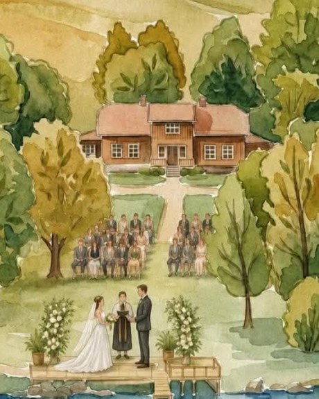

# Alexander & Tonje — bryllupsnettsted

Statisk, tospråklig (norsk/engelsk) nettsted for bryllupet på
**Huser Gård — WonderInn Riverside**, Fenstad, lørdag 28. august 2027.

Ingen byggesteg, ingen rammeverk, ingen avhengigheter. Bare HTML, CSS og litt
JavaScript. Filene kan åpnes direkte i nettleseren, eller legges rett ut på
GitHub Pages, Netlify, Vercel eller en hvilken som helst webhotell-konto.

---

## Innhold

| Fil | Side |
| --- | --- |
| `index.html` | Forside — nedtelling, kort program, snarveier |
| `historien.html` | Vår historie og brudefølget |
| `programmet.html` | Fullt program fredag–søndag |
| `praktisk.html` | Sted, transport, overnatting, antrekk, FAQ |
| `galleri.html` | Bildegalleri med lightbox |
| `onskeliste.html` | Gaveønsker og bryllupsreise |
| `rsvp.html` | Påmeldingsskjema |
| `tale.html` | Meld tale eller innslag til toastmaster |
| `kontakt.html` | Kontaktinfo og kontaktskjema |
| `404.html` | Feilside |

```
assets/
  css/style.css     Hele designsystemet — farger, typografi, komponenter
  js/config.js      All konfigurasjon (navn, dato, adresse, e-post, skjema)
  js/main.js        Språkbytte, nedtelling, meny, galleri, skjemainnsending
  img/favicon.svg      Faviconet
  img/save-the-date.jpg  Kortet som ble sendt ut
  img/landskap.jpg       Akvarellen alene — brukt som bånd på forsiden
  img/gaarden.jpg        Utsnitt av gården og vielsen
  img/og-image.jpg       Vises når lenken deles (1200 × 630)
```

---

## Slik endrer du innhold

**Tekst, datoer og adresser som går igjen** ligger i `assets/js/config.js`.
Endrer du dem der, oppdateres de overalt på nettstedet.

**Sidetekst** endres direkte i den aktuelle HTML-filen.

**Meny og bunntekst** er gjentatt i hver HTML-fil. Legger du til en side, må
lenken inn i `<nav class="nav">` og i `<footer>` på alle sidene.

---

## Tospråklighet

Standardspråket er norsk. Alle tekster finnes i to varianter:

```html
<span class="no">Norsk tekst</span><span class="en">English text</span>
```

For hele avsnitt brukes klassen på selve elementet:

```html
<p class="no">Norsk avsnitt.</p>
<p class="en" lang="en">English paragraph.</p>
```

CSS-en viser bare det aktive språket. Uten JavaScript vises norsk.
Valget lagres i nettleseren, slik at gjesten slipper å velge på hver side.

For attributter (plassholdertekst, `aria-label`, alternativer i nedtrekkslister)
brukes dataattributter som `main.js` bytter ut:

```html
<input data-no-placeholder="Fornavn" data-en-placeholder="First name">
<option data-no-text="Ikke bestemt" data-en-text="Not decided">Ikke bestemt</option>
```

**Legger du til ny tekst, må begge språk fylles inn.**

---

## Bilder

Alle steder som venter på et bilde er markert med en tydelig plassholder som
sier hva bildet skal vise og hvilket format det bør ha. Slik bytter du:

```html
<!-- Erstatt dette -->
<figure class="ph ph-4x5">
  <div class="ph__inner">…</div>
</figure>

<!-- med dette -->
<figure>
  
</figure>
```

Anbefalte størrelser står i hver plassholder. Komprimer bildene før du legger
dem inn — 300–500 kB per bilde holder i massevis.

Bilder fra WonderInn må avklares med dem før bruk.

### Bilder fra WonderInn / Huser Gård

Nettstedet er forberedt på bilder fra stedet. Lagre filene i `assets/img/`
med navnene under, og bytt ut plassholderen på den siden som er nevnt —
plassholderen sier selv hvilket filnavn den venter på.

| Filnavn | Hvor det vises | Format |
| --- | --- | --- |
| `laaven.jpg` | `galleri.html` — «Låven» | Liggende, 1800 × 1200 px |
| `vorma.jpg` | `galleri.html` — «Elva Vorma» | Liggende, 1800 × 1200 px |
| `speilhyttene.jpg` | `galleri.html` — «Speilhyttene» | Liggende, 1800 × 1200 px |
| `alpakkaene.jpg` | `galleri.html` — «Alpakkaene» | Liggende, 1800 × 1200 px |
| `kart.jpg` | `praktisk.html` — kartet over gården | Liggende, 1600 × 900 px |
| `antrekk.jpg` | `praktisk.html` — antrekk | Stående, 1000 × 1250 px |

**Om rettigheter:** bildene på wonderinn.no er deres eget materiale. Til en
privat bryllupsside sier de fleste steder ja uten videre, men spør dem først —
en kort e-post holder. Mange leverer også gjerne filer i høyere oppløsning enn
det som ligger på nettsiden.

### Bildene som allerede ligger inne

Akvarellen fra save the date-kortet er klippet ut og brukt fire steder:
som bånd under forsidens tittel, som selve kortet i «Save the date»-seksjonen,
som utsnitt ved omtalen av gården, og som delebilde når lenken sendes videre.

Utsnittene er hentet fra kortet slik det ble mottatt på telefon, altså
1077 piksler bredt. Det holder fint på mobil og godt nok på skjerm, men blir
litt mykt på store skjermer. **Har dere originalfilen fra den som tegnet
kortet, bytt den inn** — da blir forsidebåndet skarpt hele veien.

---

## Gjenstår å fylle inn

### Må gjøres før siden deles med gjestene

- [ ] **Skjemaene lagrer ingenting ennå.** Opprett et skjema hos for eksempel
      [Formspree](https://formspree.io) eller Google Forms, og lim endepunktet
      inn i `rsvpEndpoint` i `assets/js/config.js`. Til det er gjort, sender
      skjemaene svaret som ferdig utfylt e-post i stedet — det virker, men
      krever at gjesten trykker én gang til.
- [ ] **E-postadresser** i `config.js`: `rsvpEmail`, `contactEmail` og
      `toastmaster.email`.
- [ ] **Bekreft adressen** til gården (`venueStreet` i `config.js`) med
      WonderInn, inkludert riktig innkjørsel for gjester.
- [ ] **Vipps-nummer og kontonummer** på `onskeliste.html`.
- [ ] **Navn på toastmaster og forlovere** på `historien.html` og `kontakt.html`.

### Bør på plass etter hvert

- [ ] Originalfilen av akvarellen i full oppløsning, om den finnes — se over.
- [ ] Bilder fra WonderInn / Huser Gård — se tabellen over.
- [ ] Bilder til brudefølget og kontaktsiden.
- [ ] Bekreft busselskap, oppmøtested i Oslo og avgangstider (`praktisk.html`).
- [ ] Bekreft om fredagen blir noe av, og hvem som inviteres (`programmet.html`).
- [ ] Konkrete hotellnavn, eventuell rabattkode og fristen for et gjestekvotum.
- [ ] Deres egen historie i tidslinjen på `historien.html` — årstallene som står
      der nå er et utkast.
- [ ] Meny og drikkeopplegg, når det er avklart med kjøkkenet.

### Etter bryllupet

- [ ] Lenke til delt bildealbum på `galleri.html`.

---

## Adressen til nettstedet

Nettstedet ligger på **https://tonjeogalexander.vercel.app** og publiseres
automatisk av Vercel ved hver push.

`og:url`, `og:image` og `canonical` i hver HTML-fil er **absolutte adresser**.
Det må de være — med relativ sti vises ikke delingsbildet når lenken sendes i
Messenger, iMessage eller Facebook.

Får dere eget domene (for eksempel `tonjeogalexander.no`), er det ett søk og
erstatt over alle HTML-filene:

```
grep -rl "tonjeogalexander.vercel.app" *.html \
  | xargs sed -i 's|https://tonjeogalexander.vercel.app|https://tonjeogalexander.no|g'
```

### Skal siden være søkbar?

Siden er i dag åpen for Google. Vil dere at bare de som har fått lenken skal
finne den, legg denne linjen i `<head>` på alle sidene:

```html
<meta name="robots" content="noindex, nofollow">
```

## Publisering

**GitHub Pages:** slå på Pages for repoet under Settings → Pages, med `main`
som kilde. Siden ligger da på `https://<bruker>.github.io/bryllup/`.

**Eget domene:** legg en fil ved navn `CNAME` i rotmappen med domenet i,
og pek domenet mot GitHub Pages hos domeneleverandøren.

**Netlify eller Vercel:** dra mappen inn i grensesnittet, eller koble repoet.
Ingen byggekommando, ingen utmappe — det er ren HTML.

---

## Teknisk

- Fungerer uten JavaScript: all tekst, program og informasjon vises fortsatt
  (på norsk), og skjemaene kan sendes som e-post.
- Tastaturvennlig, med hopp-til-innhold-lenke, synlig fokusmarkering og
  `aria`-merking der det trengs.
- Respekterer `prefers-reduced-motion` — animasjoner slås av for de som ber om det.
- Egen utskriftsstil: `programmet.html` kan skrives ut som et rent program.
- Skjemaene har en skjult spamfelle (`_gotcha`) som de fleste roboter går i.
